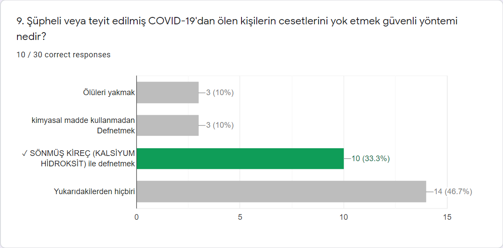

```{r setup, include=FALSE}
knitr::opts_chunk$set(echo = TRUE)
```

## Project Description
A COVID-19 Awareness Quiz was prepared for Bachelor students of Mugla Sitki Kocman University. As some of the faculties in MSKU are taught in Turkish, so the quiz was prepared in Turkish language. There were 5 demographics questions as listed below:

* Name and Surname
* Gender
* Faculty
* Class
* Citizenship
* And Date of birth

The quiz contained 10 questions with multiple choice, each correct answer 10 point. The questions are listed below:   
   Note: As special Turkish characters are not supported by R-Markdown, they are replaced with the similar characters in English.

1. COVID-19 nasil bulasir?
    + Temiz olmayan su ve hava yoluyla bulasir
    + Virus hasta bireylerden oksurme, hapsirma yoluyla ortaya sacilan damlaciklarla bulasabilir
   + Temiz alanlardan ve hayvanlar yoluyla bulasir
   + Yukaridakilerden hepsi
  
2. COVID-19'un yaygin semptomlari nelerdir? 
    + Yorgunluk
    + Ates
    + Kuru oksuruk
    + Hepsi
    
3. Her zaman birinin COVID-19 olup olmadigini soyleyebilir misiniz?
    + Hayir- bireyin COVID-19 semptomlari gosterilmeyebilir ama cok iyi bir Tasiyici olabilir
    + Evet - bireyin geldigi ulke'den, irkini ve etnik kokenin yoluyla soyleyebilir
    + Evet - COVID-19 olan hastalar cok oksuruyorlar
    + Hicbiri
    
4. Ellerimizi nasil KOVID 19'dan koruyabiliriz?
    + Sabun ve su ile yikamak
    + yanliz su ile yikamak
    + Yikanmadan yalniz Kagit mendil ve ya bez ile  silmek
    + Sabun ve su ile yikamak ve en az 20 saniye ovalamak
    
5. Asagidakilerden kimler COVID-19 Enfeksiyonun riskli gruptadir? (tum dogru yanitlari secin)
    + cocuklar
    + Yaslilar - ozellikle 60 yas ustu olanlar
    + Sigara icenler
    + Kronik hastaligi var olanlar

6. COVID-19'un kesin tedavisi var mi?
    + Evet - Sicak icecekler COVID-19'u iyilestirebilir
    + Hayir - COVID-19 bir olum cezasidir
    + Hayir- ama cogu insan (yaklasik %80) ozel tedaviye ihtiyac duymadan hastaliktan iyilesir.
    
7. Asagidakilerden hangisi fiziksel mesafeye bir ornektir?
    + Kalabalik yerlere gitmemek ve yakinlarimizin evlerine ziyaret etmemek
    + Birlikte yasadiginiz insanlarla konusmayi birakmak
    + Telefon yoluyla arkadaslarinizla konusmamak
    + Ailedeki herkes kendi odasinda salgin bitmesine kadar karantinada kalmak
    
8. Dogru veya Yanlis: ABD'de 35 yasin altindaki insanlar koronavirus ile enfekte olabilir ve hastalanabilir, ancak bu yas grubunda genc yetiskinlerin COVID olumleri bildirilmemistir.
    + Dogru
    + Yanlis

9. supheli veya teyit edilmis COVID-19'dan olan kisilerin cesetlerini yok etmek guvenli yontemi nedir?
    + oluleri yakmak
    + kimyasal madde kullanmadan Defnetmek
    + SoNMus KIREC (KALSIYUM HIDROKSIT) ile defnetmek
    + Yukaridakilerden hicbiri
    
10. COVID-19 icin bugune kadar asi gelistirildi mi?
    + Evet
    + Hayir
    

## Importing the relevant libraries
```{r echo=T, results='hide', warning=FALSE, message=FALSE}
library(ggplot2)
library(dplyr)
library(GGally)
library(car)
```


## Loading the data
```{r}
df <- read.csv('data.csv')
head(df, n=3)
```

## Data	visualization	and	descriptive	states
#### Analyzing Quiz Score
```{r}
summary(df$Score)

ggplot(data=df, aes(x=Score)) +
  geom_bar(fill="blue", alpha=0.7)+
  labs(title = "Quiz Score BarChart", x="Score", y="Count")
```

As it is written above, average is 73.67/100, median is 80/100 and Range is 40-100 Points.


#### Analyzing Students score based on gender
```{r}

summary(df[df$Cinsiyet=="Erkek", 2])

summary(df[df$Cinsiyet=="Kadin", 2])

ggplot(data=df, aes(x=Cinsiyet, y=Score, fill= Cinsiyet)) +
  geom_boxplot() + 
  labs(title = "Students score based on gender Boxplot", x = "Gender", y="Score") +
  stat_summary(fun=mean, geom="point", shape=4, size=2)
```

Referring to boxplot above, the score for male students is very disperse  than the score for female students, and the mean and median of scores for female students are a lot higher than male students. We will test it later to check whether the differences are significant.

#### Analyzing Students Gender
```{r}
# Cast data-type of gender to factor(nominal)
df$Cinsiyet <- as.factor(df$Cinsiyet)

# Print summary of gender
summary(df$Cinsiyet)
```

23 Male and 7 Female students participated in this Quiz.

#### Analyzing Students Faculty based on gender
```{r}
# Cast data-type of Faculty to factor(nominal)
df$Fakulte <- as.factor(df$Fakulte)

# Print summary of Faculty
summary(df$Fakulte)

# Graph
ggplot(df, aes(x=Fakulte, fill=Cinsiyet))+
  geom_bar() + 
  labs(title = "Students Faculty based on Gender BarChart",x= "Faculty",y= "Count") +
  theme(axis.text.x=element_text(angle=-45,hjust=0,vjust=0))
```

The Graph above indicates most of the students participated in the quiz are Male and from Engineering faculty.

#### Analyzing Score based on Faculty
```{r}
ggplot(data=df, aes(x=Fakulte, y=Score, fill= Fakulte)) +
  geom_boxplot() + 
  labs(title = "Students score based on faculty Boxplot", x = "Faculty", y="Score") +
  stat_summary(fun=mean, geom="point", shape=4, size=2) +
  theme(axis.text.x=element_text(angle=-45,hjust=0,vjust=0))
```

The above figure shows, most probably the average of score are equal for all faculties except the technology faculty.

#### Analyzing students class
```{r}
classes <- data.frame(table(df$Sinif))
names(classes) <- c("class", "freq") 
classes

ggplot(classes, aes(x=class, y=freq, fill=class))+
  geom_bar(stat = "identity") + 
  labs(title = "Students class BarChart", x="Class", y="Response")

```

The figure indicates most of students are from 3rd class.

#### Analyzing students score based on class 
```{r}

df$Sinif <- as.factor(df$Sinif)

ggplot(data=df, aes(x=Sinif, y=Score, fill= Sinif)) +
  geom_boxplot() + 
  labs(title = "Students score based on class Boxplot", x = "Class", y="Score") +
  stat_summary(fun=mean, geom="point", shape=4, size=2) +
  theme(axis.text.x=element_text(angle=-45,hjust=0,vjust=0))

```

Referring to above boxplot, there is just one outlier for 2nd class and most probably their mean and their median are equal. We can test later to check whether the differences between them are significant.

#### Analyzing Students score based on Citizenship
```{r}
df$Vatandaslik <- as.factor(df$Vatandaslik)
summary(df$Vatandaslik)

ggplot(data=df, aes(x=Vatandaslik, y=Score, fill= Vatandaslik)) +
  geom_boxplot() + 
  labs(title = "Students score based on Citizenship Boxplot", x="Citizenship", y="Score") +
  stat_summary(fun=mean, geom="point", shape=4, size=2) +
  theme(axis.text.x=element_text(angle=-45,hjust=0,vjust=0))
```

The boxplot shows students score is associated with citizenship.

#### Analyzing students date-of-birth
```{r}
# Extracting year from date
df$Dogum.Tarihi <- as.Date(df$Dogum.Tarihi, "%m/%d/%Y")
df$age <- as.numeric(format(df$Dogum.Tarihi, "%Y"))

df$age <- 2020 - df$age

age.df <- data.frame(table(df$age))
names(age.df) <- c("age", "freq")
age.df


ggplot(age.df, aes(x=age, y=freq, fill=age))+
  geom_bar(stat = "identity") + 
  labs(title = "Students Age BarChart", x="Age", y="n.response")
```

The figure shows most of the students participated to quiz are between 21-25 years old.

#### Analyzing Score based on age
```{r}
df$age <- as.factor(df$age)
ggplot(data=df, aes(x=age, y=Score, fill= age)) +
  geom_boxplot() + 
  labs(title = "Students score based on Age Boxplot", x="Age", y="Score") +
  stat_summary(fun=mean, geom="point", shape=4, size=2) +
  theme(axis.text.x=element_text(angle=-45,hjust=0,vjust=0))

var(df[df$age=="27", 2])
```

The boxplot indicates that the score of students with age 23 is very disperse. Also it indicates that the mean and median of students score with age 26 is less than the rest of students.

### The Google-Form beautiful and informative analysis graphs





## Confidence	intervals
### Q1: 
Find confidence interval for score evaluating the differences based on gender. Use ggplot2 to plot the corresponding confidence intervals to support your evaluations.

Let's start by calculating confidence interval for students score based on gender.
```{r}
males <- subset(df, Cinsiyet=="Erkek")
females <- subset(df, Cinsiyet=="Kadin")

# Calculating confidence interval for score of male students 
x <- t.test(males$Score)$conf.int
x
```

The above output indicates that the true average of score for male students is between 62.61 and 76.52 with 95% confident.

```{r}

# calculating confidence interval for females score
y <- t.test(females$Score)$conf.int
y

```

Also the above output indicates that the true average of score for female students is between 80.15 and 94.13 with 95% confident.

To conclude, It looks there is no overlap between males and females score confidence interval and it's a clue that the difference may be significant, but we cannot be sure. We must perform statistical test to draw a conclusion.

Here is how it looks like when we visualize it.
```{r}
students.score <- data.frame(gender="Male",
                                scoreType="score", 
                                mean=mean(males$Score), 
                                lower=x[1], 
                                upper=x[2])

students.score <- rbind(students.score, data.frame(gender="Female",
                                scoreType="score", 
                                mean=mean(females$Score), 
                                lower=y[1], 
                                upper=y[2]))

ggplot(students.score, aes(x=scoreType, y=mean, fill=gender)) +
  geom_bar(position="dodge", stat="identity", width = 0.3) +
  geom_errorbar(aes(ymin=lower, ymax=upper),
                width=.1, # Width of the error bars
                position=position_dodge(0.3))
```


### Q2: 
Find confidence interval for score evaluating the differences based on citizenship. Use ggplot2 to plot the corresponding confidence interval to support your evaluations.

Here we will calculate confidence interval for students score based on citizenship.
```{r}
Turkish <- subset(df, Vatandaslik=="Turk Uyruklu")
foreigner <- subset(df, Vatandaslik=="Yabanci Uyruklu")

# Calculating confidence interval for score of Turkish students 
x <- t.test(Turkish$Score)$conf.int
x
```

The above output indicates that the true average of score for male students is between 82 and 93 with 95% confident.

```{r}

# calculating confidence interval for score of foreigner-students
y <- t.test(foreigner$Score)$conf.int
y

```

Also the above output indicates that the true average of score for female students is between 57.79 and 71 with 95% confident.

To conclude, It looks there is no overlap between Turkish and foreigner score confidence interval and it's a clue that the difference may be significant, but we cannot be sure. We must perform statistical test to draw a conclusion.

Here is how it looks like when we visualize it.
```{r}
students.score <- data.frame(Citizenship="Turk",
                                X_axis="score", 
                                mean=mean(Turkish$Score), 
                                lower=x[1], 
                                upper=x[2])

students.score <- rbind(students.score, data.frame(Citizenship="Foreigner",
                                X_axis="score", 
                                mean=mean(foreigner$Score), 
                                lower=y[1], 
                                upper=y[2]))

ggplot(students.score, aes(x=X_axis, y=mean, fill=Citizenship)) +
  geom_bar(position="dodge", stat="identity", width = 0.3) +
  geom_errorbar(aes(ymin=lower, ymax=upper),
                width=.1, # Width of the error bars
                position=position_dodge(0.3))
```

## Hypothesis	testing
### ONE SAMPLE TEST
#### Q1: Create one sample hypothesis for mean of male students score and test it with 95% confidence level.

Let's test that the true average of male students score is equal to 75,
So the hypothesis is formulated as following:   
H0: mu = 75   
Ha: mu != 75   

The data is not continues, but for the lack of continues data in our dataset, let's assume the data is continues and we assume the sample is a simple random sample.
As the sample size is not large enough, we will assess the normality.
In order to assess normality of data, we can use qqplot and shapiro test.
```{r}
shapiro.test(males$Score)
```
As the p-value > 0.05, the null hypothesis is not rejected, so data is normally distributed.

Let's visualize it using Q-Q Plot.
```{r}
qqnorm(males$Score, ylab = "Males score")
qqline(males$Score)
```

Now it is time to test the hypothesis.
```{r}
t.test(males$Score, 
       alternative = "two.sided", 
       mu=75, 
       conf.level = 0.95)
```

To conclude, as p-value > 0.05, the null hypothesis is not rejected and the confidence interval is between 62.6 and 75.5 with 95% confident.

## TWO SAMPLE TEST
### Q2: Are	there	significant	difference	between	mean	of male and female students score?
To start, it always helps to plot things!!!
```{r}

# Create boxplot showing how score varies based on gender
qplot(x = Cinsiyet, y = Score,
      geom = "boxplot", data = df,
      xlab = "Gender",
      ylab = "Score",
      fill = I("lightblue"))
```

This plot suggests that score is associated with gender.

Let's compute a summary table
```{r}
aggregate(Score ~ Cinsiyet, 
          data = df,
          FUN = function(x) {c(mean = mean(x),
                               se = sd(x) / sqrt(length(x)))})

```

This difference is looking quite significant.

Let's visualize it.
```{r}
# Density plots
qplot(fill = Cinsiyet, 
      x = Score, 
      data = df, 
      geom = "density",
      alpha = I(0.5),
      adjust = 2
      )
```

Let's check if the populations have the same variance.
```{r}
x <- subset(df, Cinsiyet=="Erkek")$Score
y <- subset(df, Cinsiyet=="Kadin")$Score
var.test(x, y)
```
As p-value > 0.05, the null hypothesis is not rejected and the variances are equal.  

As the sample size is not large enough, we will assess the normality.
We have already assess normality of male student scores and it was normal.
So we will check normality just for female student scores.
In order to assess normality of data, we can use qqplot and shapiro test.
```{r}
shapiro.test(females$Score)
```
As the p-value > 0.05, the null hypothesis is not rejected, so data is normally distributed.

Let's visualize it using Q-Q Plot.
```{r}
qqnorm(females$Score, ylab = "Females score")
qqline(females$Score)
```

Although female student scores are not large enough and the data is not continues, it is hard to say it is normal or not. However, as it is mentioned in Instructions-for-Final-Project document we will assume the data is normal.

Checking assumptions:

  * The two samples are random and independent.
  * The sample size per gender is not large enough, but we assume the data are normal.
  * The variances are equal.

```{r}
t.test(x=x, y=y, alternative = "two.sided", var.equal = TRUE,
       conf.level = 0.95)
```

To conclude, as p-value < 0.05, the null hypothesis is rejected.
We can conclude that there is statistically significant difference between male and female students score.

### Q3: Are	there	significant	difference	between	mean	of Turkish	and	foreigner students scores?

Again we start by plotting!!!
```{r}

# Create boxplot showing how score varies based on citizenship
qplot(x = Vatandaslik, y = Score,
      geom = "boxplot", data = df,
      xlab = "Citizenship",
      ylab = "Score",
      fill = I("lightblue"))
```

This plot suggests that score is associated with Citizenship.

Let's compute a summary table
```{r}
aggregate(Score ~ Vatandaslik, 
          data = df,
          FUN = function(x) {c(mean = mean(x),
                               se = sd(x) / sqrt(length(x)))})

```

This difference is looking quite significant.

Let's visualize it.
```{r}
# Density plots
qplot(fill = Vatandaslik, 
      x = Score, 
      data = df, 
      geom = "density",
      alpha = I(0.5),
      adjust = 2
      )
```

Let's check if the populations have the same variance.
```{r}
x <- subset(df, Vatandaslik=="Turk Uyruklu")$Score
y <- subset(df, Vatandaslik=="Yabanci Uyruklu")$Score
var.test(x, y)
```
As p-value > 0.05, the null hypothesis is not rejected and the variances are equal.  

As the sample size is not large enough, we will assess the normality.
In order to assess normality of data, we can use qqplot and shapiro test.
```{r}
shapiro.test(Turkish$Score)
```
As the p-value > 0.05, the null hypothesis is not rejected, so data is normally distributed.

Let's visualize it using Q-Q Plot.
```{r}
qqnorm(Turkish$Score, ylab = "Turkish students score")
qqline(Turkish$Score)
```

Although Turkish-student scores are not large enough and the data is not continues, it is hard to say it is normal or not. But, again we assume it is normal for the reason we mentioned above.
Now, we will check normality for foreigner-students scores.
```{r}
shapiro.test(foreigner$Score)
```
As the p-value > 0.05, the null hypothesis is not rejected, so data is normally distributed.

Let's visualize it using Q-Q Plot.
```{r}
qqnorm(foreigner$Score, ylab = "Foreigner-students scores")
qqline(foreigner$Score)
```

Foreigner-students scores are not large enough and the data is not continues, it is hard to say it is normal or not. However, as it is mentioned in Instructions-for-Final-Project document we will assume the data is normal.

Checking assumptions:

  * The two samples are random and independent.
  * The sample size per citizenship is not large enough, but we assume the data are normal.
  * The variances are equal.

```{r}
t.test(x=x, y=y, alternative = "two.sided", var.equal = TRUE,
       conf.level = 0.95)
```

To conclude, as p-value < 0.05, the null hypothesis is rejected.
We can conclude that there is statistically significant difference between Turkish and foreigner students score.

## ANOVA
### Q1: Are	there	significant	differences	between	mean of different classes score?

```{r}
data <- df[, c(2, 6)]
names(data) <- c("score", "class")

# Show a random sample
set.seed(1234)
dplyr::sample_n(data, 10)

# Show the levels
levels(data$class)

# Compute summary statistics by class - count, mean, sd:
group_by(data, class) %>%
  summarise(
    count = n(),
    mean = mean(score, na.rm = TRUE),
    sd = sd(score, na.rm = TRUE)
  )
```
The Hypothesis is as following:   
H0: mu1=mu2=mu3=mu4   
Ha: At least one of them is different   

#### 1) Visualization
```{r}
ggplot(data=data, aes(x=class, y=score, fill= class)) +
  geom_boxplot() + 
  labs(title = "Students Score based on Class Boxplot", x = "Class", y="Score") +
  stat_summary(fun=mean, geom="point", shape=4, size=2) +
  theme(axis.text.x=element_text(angle=-45,hjust=0,vjust=0))
```

The figure indicates most probably their mean are equal.

#### 2) Assumptions
##### Normality Assumption
First, we will check normality assumption by shapiro-test.
```{r}
shapiro.test(data[data$class=="1", 1])
shapiro.test(data[data$class=="2", 1])
shapiro.test(data[data$class=="3", 1])
shapiro.test(data[data$class=="4", 1])
```

For the 1st and 2nd classes as their p-value < 0.05, we can conclude that they are normal. But, for the 3rd and 4th classes as their p-value > 0.05, we can not conclude that they are normal with this test. So, let's use qqplot.
```{r}
qqnorm(data[data$class=="3", 1], ylab = "3th Class Score")
qqline(data[data$class=="3", 1])
```

As you can see the figure, the score is around the straight line, but, there are just two score in the bottom and top of the figure which are a little far from straight line and we ignore it. So we can conclude that the score for 3th class is roughly normal.

Let's see qqplot for 4th class score.
```{r}
qqnorm(data[data$class=="4", 1], ylab = "4th Class Score")
qqline(data[data$class=="4", 1])
```

The 4th class score is also around the straight line and there is one score which is a little far from the straight line which we ignore it. As a result we can say score for 4th class is roughly normal.

##### Variance homogeneity
```{r}
bartlett.test(score~class, data=data)
```

Based on output of barlett-test, p-value > 0.05 So, the null hypothesis is not rejected and variances are equal.

#### 3) Analysis of variance

```{r}

model<-aov(score~class, data=data)
summary(model)

```

The p-value > 0.05, we can conclude that there is no significant differences between the classes score.   
**As there is no significant difference between the classes score, we cannot conduct Posthoc-test.   
Also unfortunately, there are not enough data(students scores) based on faculty and age, So we can't conduct ANOVA on them.**

```{r echo=FALSE}
rm(age.df, classes, data, females, foreigner, males, students.score, Turkish, x, y)
```

## Linear Regression
Though building a linear regression model might not be necessary or might not have any implication for an awareness test, I would like to just discover linear regression and its functions.   

First, I will prepare dependent and independent variables. I will choose score as dependent variable.
```{r}
# Get relevant columns
reg.df <- df[, c(4, 5, 6, 7, 19, 2)]

# convert age and class to numeric type
reg.df$age <- as.numeric(as.character(reg.df$age))
reg.df$Sinif <- as.numeric(as.character(reg.df$Sinif))

head(reg.df)
```
Now the data is ready.
```{r}

# correlation for class, age and score
cor(reg.df[,c(3, 5, 6)])

plot(reg.df[,c(3, 5, 6)])
```

There were just 3 numeric values in our dataset. Based on above output we can conclude as following:

  * There is no correlation between score and class
  * There is weak negative correlation between score and age.   
  Does this mean, increase in age cause lower awareness score?   
  Well, the answer is: No, Correlation always does not imply causation!
  * And lastly, there is moderate correlation between class and age


```{r warning=FALSE, message=FALSE}
ggpairs(reg.df, cardinality_threshold=30)
```


```{r}
# Fitting Multiple Linear Regression to the Training set
model = lm(formula = Score ~ .,
               data = reg.df)


summary(model)
```
Looking to above output, one can conclude as following:

* Based on p-values, it looks like age, faculty and Citizenship are all statistically significant predictors of score.
* The value for Beta-sub-zero is 25.674.
* The coefficients for gender and faculty are all negative.
* The only positive coefficient is gender.
* Multiple R-squared:  0.7395 means, 73.95% of variability in score can be explained by linear relationship with independent(explanatory) variables which is enoughly large. The other 26.05% is random variation that is unexplained by this linear relationship.

```{r}
vif(model)

reduced.model<-step(model)
summary(reduced.model)

```

There was no correlation between score and class, so class variable is deleted by step function. Also note that Adjusted R-squared is increased by 1.55%.   
   
We should check the residual plot to see if the assumptions of our model are reasonable. Our simple linear regression model assumes that the theoritical error terms are normally distributed and have constant variance and are independent of one another.

```{r}
plot(reduced.model, which = 1)
```

Above plot indicates that by increasing x values, the variability for residual also decreases and increases by some outliers(9, 18 and 29) in the data. So, something systematic is going on and there is a problem with our assumed model. Also it is against the regression assumptions.    
Note: Using my sixth sense, it looks the variability is not pretty high. So it might be normal.    
Some more experience or knowledge is required for better interpretation.

```{r}
plot(reduced.model, which = 2)
```

The residual is approximately normal, so it passes the normality assumption.   

```{r}
plot(reduced.model, which = c(3, 5))
```

## Discussion:

* What	implications	do	your	results	have	for	the	population	you	sampled	from?   
   
   The test was targeting bachelor students of MSKU to check their awareness about virus COVID-19. Based on statistical methods applied above, we can conclude as following:
   * The average scores of the students were 73.67%. So the result looks satisfying.
   * The scores of Female students were significantly higher than Male students.
   * The scores of Turkish students were also significantly higher than Foreigner students.
   * The awareness of students in different faculties were the same.
   * Also, the awareness of students in different classes were the same.      
         
* What	could	be	done	to	improve	the	study	if	it	was	done	again?   
   
   The method used for sampling was simple random sampling, I did my best to send the test to all of students in different faculties, but it looks, it didn't reach to all. If this study is about to be done again, I would choose stratified sampling method. Also, the sample size was very small, So increasing the sample size might improve this study. Furthermore, the test was prepared in Turkish language, so it was easily understandable by Turkish students, but it might not be enough understandable by foreigner students. So, for next time it would be better to prepare in both English and Turkish language.
      
* What	types	of	biases	might	exist?   
   
   I think undercoverage and voluntary response biases might exist in this survey.